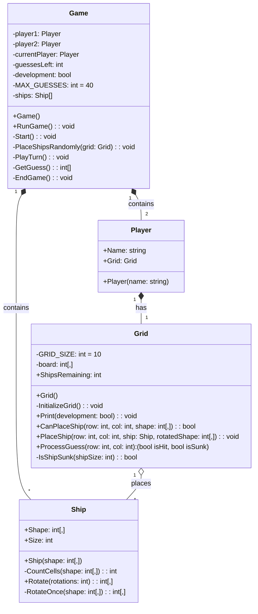

```mermaid
classDiagram
    class Ship {
        +Shape: int[,]
        +Size: int
        +Ship(shape: int[,])
        -CountCells(shape: int[,]): int
        +Rotate(rotations: int): int[,]
        -RotateOnce(shape: int[,]): int[,]
    }

    class Grid {
        -GRID_SIZE: int = 10
        -board: int[,]
        +ShipsRemaining: int
        +Grid()
        -InitializeGrid(): void
        +Print(development: bool): void
        +CanPlaceShip(row: int, col: int, shape: int[,]): bool
        +PlaceShip(row: int, col: int, ship: Ship, rotatedShape: int[,]): void
        +ProcessGuess(row: int, col: int): (bool isHit, bool isSunk)
        -IsShipSunk(shipSize: int): bool
    }

    class Player {
        +Name: string
        +Grid: Grid
        +Player(name: string)
    }

    class Game {
        -player1: Player
        -player2: Player
        -currentPlayer: Player
        -guessesLeft: int
        -development: bool
        -MAX_GUESSES: int = 40
        -ships: Ship[]
        +Game()
        +RunGame(): void
        -Start(): void
        -PlaceShipsRandomly(grid: Grid): void
        -PlayTurn(): void
        -GetGuess(): int[]
        -EndGame(): void
    }

    Game "1" *-- "2" Player : contains
    Player "1" *-- "1" Grid : has
    Game "1" *-- "*" Ship : contains
    Grid "1" o-- "*" Ship : places
```